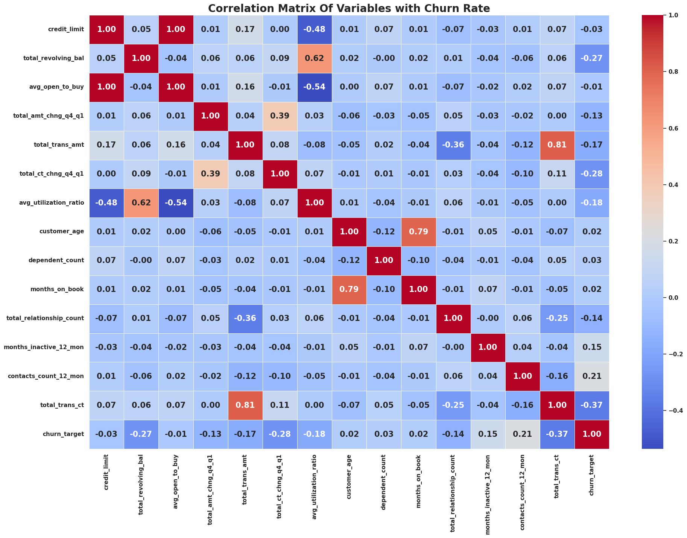
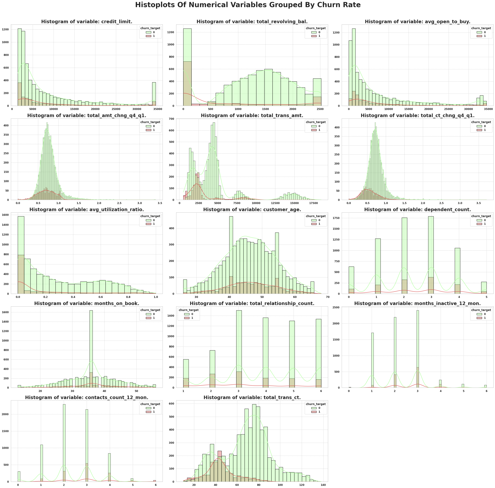
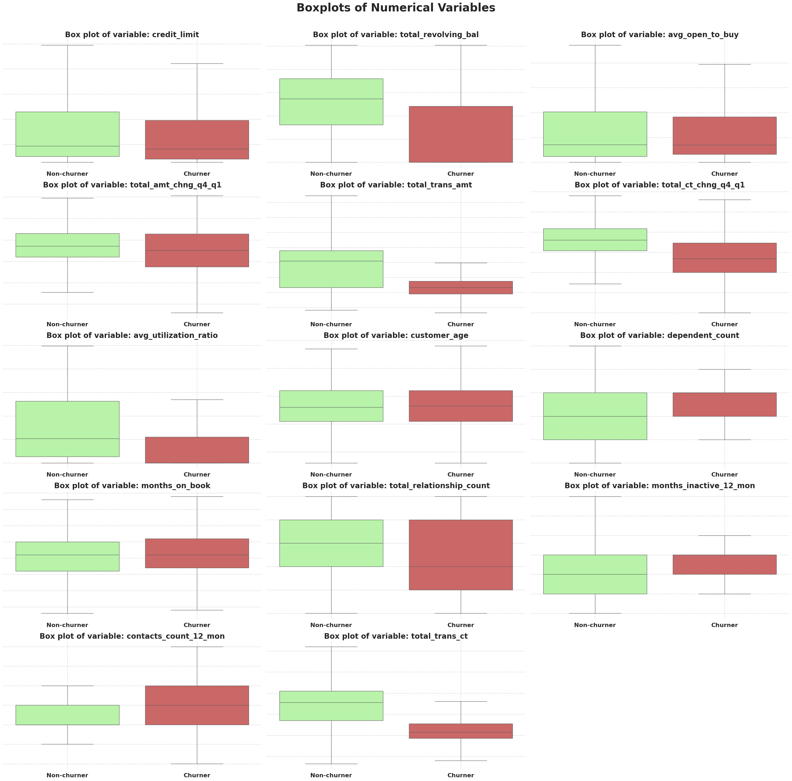
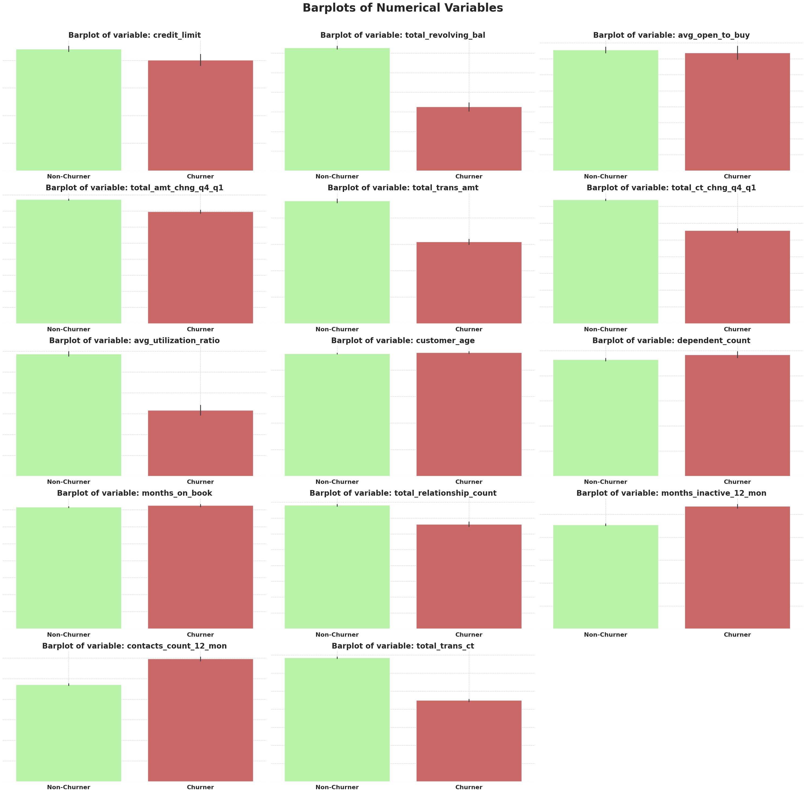
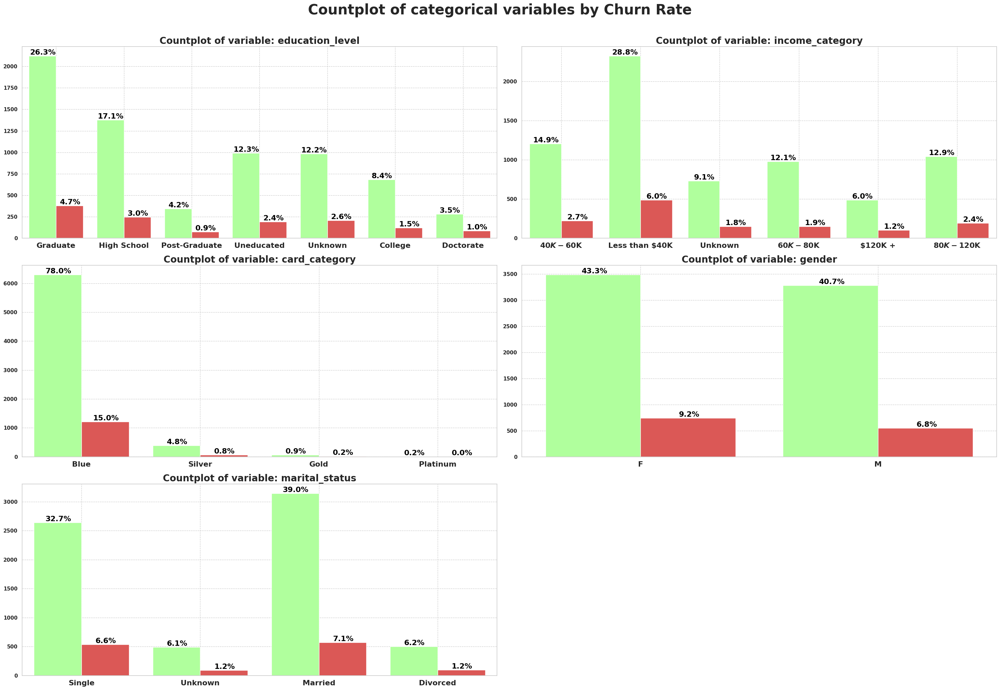
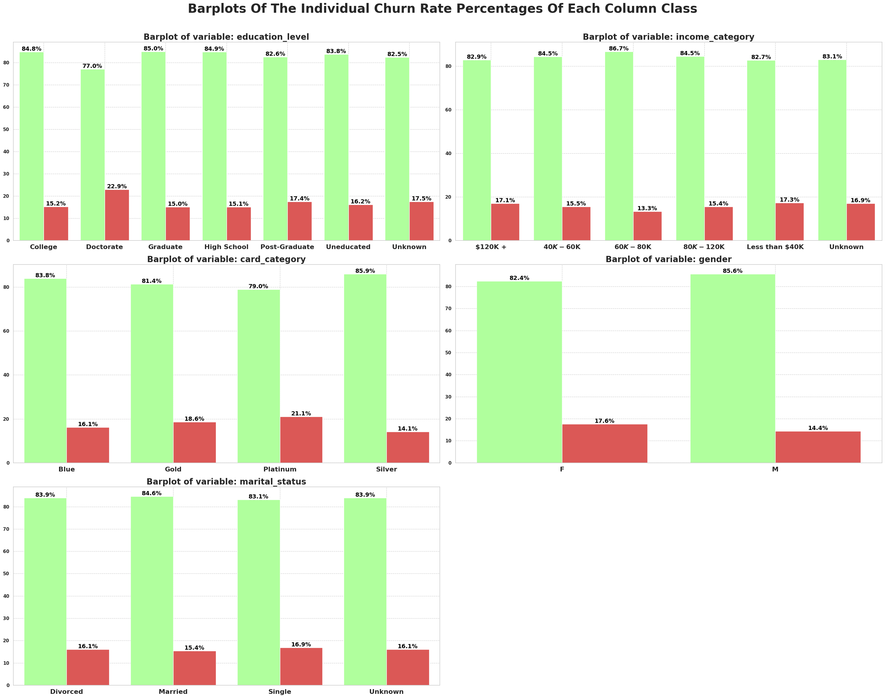
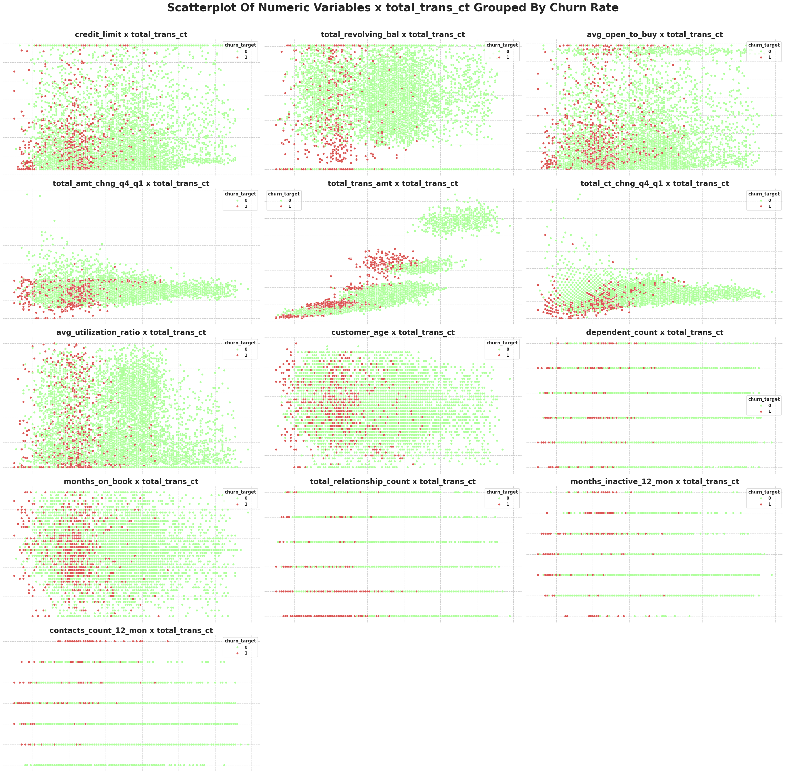
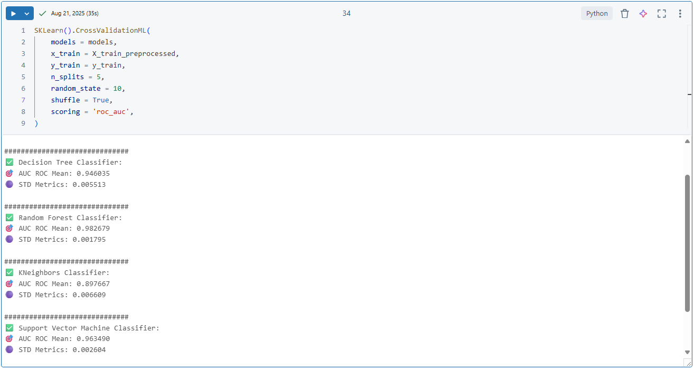
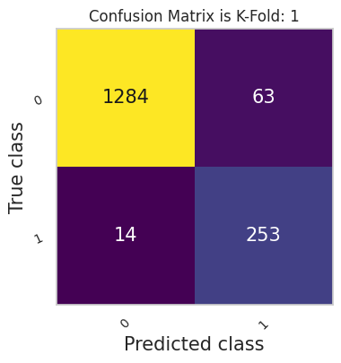
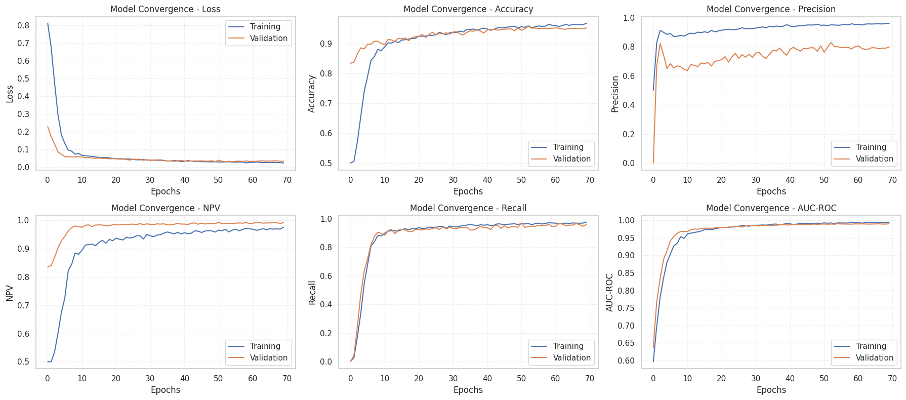

<a id="readme-top"></a>

<!-- PROJECT SHIELDS -->

[![Contributors][contributors-shield]][contributors-url]
[![Forks][forks-shield]][forks-url]
[![Stargazers][stars-shield]][stars-url]
[![Issues][issues-shield]][issues-url]
[![MIT License][license-shield]][license-url]
[![LinkedIn][linkedin-shield]][linkedin-url]

<!-- PROJECT LOGO -->

<br/>
<div align="center">
    
  
  <h3 align="center"> Churn Analysis/Prediction </h3>

  <p align="center">
    <h4>Customer churn classification of a credit card service with Pytorch as the main classification model.</h4>
    <br/>
    <a href="https://github.com/OtnielGomes/1_Portfolio-Credit-Card_Churn_Analysis_with_Pytorch/tree/main/src"><strong>Explore the Docs and Functions »</strong></a>
    <br/><br/>
    <a href="https://github.com/OtnielGomes/1_Portfolio-Credit-Card_Churn_Analysis_with_Pytorch/tree/main/notebooks">View Notebooks</a>
    ·
    <a href="https://github.com/OtnielGomes/1_Portfolio-Credit-Card_Churn_Analysis_with_Pytorch/issues/new?labels=bug&template=bug-report---.md">Report Bug</a>
    ·
    <a href="https://github.com/OtnielGomes/1_Portfolio-Credit-Card_Churn_Analysis_with_Pytorch/issues/new?labels=enhancement&template=feature-request---.md">Request Feature</a>
  </p>
</div>


<!-- TABLE OF CONTENTS -->
<details>
  <br>
  <summary>Table of Contents</summary>
  <br/>
  <ol>
    <li>
      <a href="#about-the-project">About The Project</a>
      <ul>
        <li><a href="#built-with">Built With</a></li>
      </ul>
    </li>
    <li>
      <a href="#getting-started">Getting Started</a>
      <ul>
        <li><a href="#pre-requisites">Pre-requisites</a></li>
        <li><a href="#installation-of-librarys">Installation of librarys</a></li>
      </ul>
    </li>
    <li>
      <a href="#the-project">The Project</a></li>
      <ul>
        <li><a href="#1-business-understanding">1-Business understanding</a></li>
        <li><a href="#2-data-understanding">2-Data Understanding</a></li>
        <li><a href="#3-data-preparation">3-Data Preparation</a></li>
        <li><a href="#4-modeling">4-Modeling</a></li>
        <li><a href="#5-evaluation">5-Evaluation</a></li>
        <li><a href="#6-deployment">6-Deployment</a></li>
      </ul>
    <li><a href="#roadmap">Roadmap</a></li>
    <li><a href="#contributing">Contributing</a></li>
    <li><a href="#license">License</a></li>
    <li><a href="#contact">Contact</a></li>
  </ol>
</details>

<br/>

<!-- ABOUT THE PROJECT -->
## About The Project

<br/>

## Credit Card Churn Analysis - Prediction
---  

## Project Description 
In this project, I will be working with a dataset provided by **Kaggle**, where I will develop a churn-rate analysis. The goal is to identify the causes and reasons for customer churn from a banking institution in relation to credit card services. After understanding these causes and reasons, some machine learning models will be developed to predict potential customers who will be abandoning the credit card service of this institution. With these predictions, I will seek to develop solutions to prevent or reverse the churn of these customers.  

---  

### CRISP-DM Methodology  
The project will follow the CRISP-DM (*Cross-Industry Standard Process for Data Mining*) framework:  

| **Stage** | **Objective** | **Key Actions** |  
|-----------|---------------|------------------|  
| **1. Business Understanding** | Define the impact of churn prediction on customer retention. | - Identify the causes and possible solutions for the business.<br>- Align metrics with business KPIs. |  
| **2. Data Understanding** | Analyze data structure, quality, and variable relationships. | - Exploratory Data Analysis (EDA).<br>- Outlier and correlation detection. |  
| **3. Data Preparation** | Prepare data for model training. | - Split training and test data.<br>- Remove redundant variables. |  
| **4. Modeling** | Train and compare classical models and neural networks. | - Random Forest/Logistic Regression (baseline).<br>- PyTorch neural network (focus on generalization). |  
| **5. Evaluation** | Validate performance with business-oriented metrics. | - AUC-ROC, Recall, confusion matrix.<br>- Simulate financial impact. |  
| **6. Deployment** | Deploy the model for production use. | - Build a final churn prediction model with customer behavior indicators. |  

<p align="right">(<a href="#readme-top">back to top</a>)</p>


<br/>

## Built With
<br/>

- [![Databricks][Databricks Free]][Databricks Free-url]
- [![Language Python][Python]][Python-url]
- [![Apache][Apache Spark]][Apache Spark-url]
- [![PD][Pandas]][Pandas-url]
- [![NP][NumPy]][NumPy-url]
- [![Matplot][Matplotlib]][Matplotlib-url]
- [![Scipy][Scipy]][Scipy-url]
- [![Torch][PyTorch]][PyTorch-url]
- [![Sklearn][scikit-learn]][scikit-learn-url]


<p align="right">(<a href="#readme-top">back to top</a>)</p>


<!-- GETTING STARTED -->
## Getting Started

<br/>

**Clone the repository**
```sh
git clone https://github.com/OtnielGomes/1_Portfolio-Credit-Card_Churn_Analysis_with_Pytorch
```
<br/>

### Pre-requisites

> 📌 **This entire project was built using Databricks Free Edition**.

---

### 🧠 What is Databricks Free Edition?

**Databricks Free Edition** is the free version of the Databricks platform, designed for **students, educators, developers, and data enthusiasts**.  
It replaces the former *Community Edition* and offers a **serverless** environment with limited resources — ideal for **prototyping, learning, and collaboration**.

With it, you can:
- Create interactive notebooks (Python, SQL, Scala, R)
- Use **Databricks Assistant** for code suggestions and corrections
- Train machine learning models and build data pipelines
- Collaborate in real time with other users

---

### 📝 How to Sign Up

#### 1. Go to:  
[Databricks Free Edition – Microsoft Learn](https://learn.microsoft.com/en-us/azure/databricks/getting-started/free-edition)  
#### 2. Sign in with Google, GitHub, Microsoft, or another supported provider.  
#### 3. A **free workspace** will be automatically created for you.

---

### 🧭 First Steps in the Workspace

### 1. **Workspace**
- Organize your notebooks, scripts, and datasets
- Create folders and set sharing permissions

### 2. **Notebook**
- Interactive interface for writing and running code
- Supports **Python, SQL, R, Scala**

### 3. **Databricks Assistant**
- AI-powered helper that explains, suggests, and fixes code
- Works in notebooks and SQL editor

---

### 🔧 What You Can Do in the Free Edition

| Feature                       | Description                                                                |
|--------------------------------|----------------------------------------------------------------------------|
| Create notebooks               | For data analysis, visualizations, and machine learning                   |
| Query data with SQL            | Explore datasets using the SQL editor                                     |
| Build data pipelines           | Using LakeFlow, Auto Loader, and Delta Live Tables                        |
| Train AI models                | With PySpark, MLflow, and foundation models                               |
| Create interactive dashboards  | With natural language-based visualization (Genie)                         |
| Collaborate in real time       | Share and edit notebooks with your team                                   |

---

### ⚠️ Limitations

- **Personal use only** (non-commercial)
- Limited computing resources (no dedicated clusters)
- Some advanced features unavailable (full Unity Catalog, scheduled jobs)

---

### 📚 Learning Resources

- [Databricks Academy](https://www.databricks.com/learn/free-edition) — free courses on:
  - SQL Fundamentals
  - Data Engineering with Delta Lake
  - Machine Learning with PySpark
- [Official Databricks Documentation](https://docs.databricks.com/)

### Installation of Libraries

The installation of the required libraries is performed using the command:

```python
%pip install '..\requirements.txt'
```

This command is present in the first notebook of this project.

---

💡 **Note**:  
- In Jupyter/Databricks notebooks, the `%pip` magic command installs packages directly into the current environment.  
- If your `requirements.txt` file is located in a subdirectory or at a different path, make sure to update the path accordingly (e.g., `../requirements.txt`).

<p align="right">(<a href="#readme-top">back to top</a>)</p>

<!-- USAGE EXAMPLES -->

<br/>

## The Project

### 1 - Business Understanding  
---

### General Problem Context  
#### What is Churn Rate, and What Are the Solutions to This Problem? 
Many companies struggle with customer churn and often find it challenging to reverse this trend. The metric that measures this scenario is called **churn rate**, which indicates when strategic solutions are needed to address the issue.  

In 2020, Bryce Baer published a guide on churn rate on the [Zendesk website](https://www.zendesk.com.br/blog/customer-churn-rate/?_ga=2.155312252.614584228.1623244699-1365810980.1622555740#) – a company specializing in corporate software development. The guide highlights that businesses implementing strategies to reduce churn can increase their **profitability** by nearly 40%.  

---

#### How to Calculate Churn Rate?
##### Churn Rate Formula:  
$$\text{Churn Rate} = \frac{\text{Number of customers lost during a period}}{\text{Total number of customers at the start of the period}} \times 100$$  

---

#### Impacts of a High Churn Rate
While reducing churn to zero is practically impossible, acceptable rates (4% to 5%) minimize financial impacts. Some companies operate at higher rates (5% to 7%) without significant revenue loss, depending on industry dynamics. **Key factors to define "acceptable" churn**:  
- Industry standards (e.g., SaaS vs. retail).  
- Customer lifetime value (CLV).  
- Customer acquisition cost (CAC).  

---

#### Reasons for Customer Churn
1. **Lack of Perceived Value**:  
   - Occurs when there’s a growing gap between customer expectations and actual delivery. Clear communication about product/service benefits is critical.  
2. **Poor Customer Experience**:  
   - Negative interactions (e.g., bad support, complex processes, product failures) drive churn.  
3. **Competitor Offers**:  
   - Attractive promotions or pricing from competitors can lure customers away.  
4. **Changing Customer Needs**:  
   - Failure to adapt products/services to evolving demands leads to turnover.  

---

## Project Challenge: 
The bank’s manager has observed a rising number of customers abandoning credit card services. Stakeholders aim to:  
1. **Analyze historical data** to identify root causes of churn.  
2. **Develop a machine learning model** to predict customer churn probability.  
3. **Implement strategic actions** to retain high-risk customers.  

---

## KPIs for the Churn Prediction Project:  
1. **Churn Rate**:  
   - *Definition*: Percentage of customers who discontinue credit card services within a specific period.  
   - *Goal*: Reduce this metric through targeted retention strategies.  

2. **Retention Rate**:  
   - *Definition*: Percentage of customers retained after a period.  
   - *Importance*: Directly reflects the success of retention efforts.  

3. **Customer Acquisition Cost (CAC) vs. Retention Cost**:  
   - *Definition*: Ratio of costs to acquire new customers vs. retaining existing ones.  
   - *Insight*: Retention is typically **5-7x cheaper** than acquisition.  

4. **AUC-ROC (Area Under the Receiver Operating Characteristic Curve)**:  
   - *Definition*: Measures the model’s ability to distinguish between churners and non-churners.  
   - *Target*: AUC-ROC > 0.90.  

5. **Recall**:  
   - *Definition*: Proportion of actual churners correctly identified by the model.  
   - *Importance*: High recall ensures fewer **false negatives** (missed churners), which is critical because a false negative could result in losing a customer. Retaining existing customers through targeted strategies is significantly cheaper than acquiring new ones.  

---

<p align="right">(<a href="#readme-top">back to top</a>)</p>

### 2 - Data Understanding

---

* This dataset consists of 10,000 customers mentioning their age, salary, marital_status, credit card limit, credit card category, etc.

---

- **Data file**: - BankChurners.csv

---

- **Target dependent variable**: - 'Attrition_Flag', categorical column with binary classification, i.e. 'Existing Customer'(No-churner) or 'Attrited Customer'(Churner).

---

- **The dataset colleted from kaggle**: https://www.kaggle.com/datasets/sakshigoyal7/credit-card-customers?sort=votes&select=BankChurners.csv

---
- **The dataset origin from this site**: https://leaps.analyttica.com/home

---

<br/>
<div align="center">
    
  </a>
</div>
<br/>


### 3 - Data Preparation
---

- In this step, I will initially divide the training and testing data so that the testing data does not interfere in the analyses, so that the model does not have any bias from the testing data, and only with the training data is it capable of generating good classifications with good generalization.
---
- Next, an EDA will be conducted to verify the data and its main characteristics. In this EDA, the main objective will be to understand the relationship of the data with the churn rate of this banking institution.
---
### Exploratory Data Analysis - EDA

The **Exploratory Data Analysis (EDA)** for this project will be carried out in three main stages: **Univariate Analysis**, **Bivariate Analysis**, and **Multivariate Analysis**.  
The goal is to explore and understand the patterns within the dataset, identifying relationships, trends, and potential insights that can guide the development of effective solutions.

---

#### Univariate Analysis  
- **What it is:** Examines **one variable at a time**, without considering its relationship to others.  
- **Purpose:** Understand the distribution, central tendency, and dispersion of the variable, as well as detect possible outliers.  

---

#### Bivariate Analysis  
- **What it is:** Studies **the relationship between two variables**.  
- **Purpose:** Identify correlations, patterns, or dependencies, and assess how one variable may influence the other.  

---

#### Multivariate Analysis  
- **What it is:** Investigates **three or more variables simultaneously**.  
- **Purpose:** Understand complex interactions and multidimensional patterns, identifying combinations of factors that influence the observed behavior.  

---

### Univariate Analysis 

<br/><br/>
<div align="center">
    
  </a>
</div>
<br/>

- This dataset has imbalanced classes, which can be a factor to be considered when training machine learning models. Datasets with imbalanced classes make it more difficult to train and generalize model classifications, especially for **minority** classes. In general, models tend to learn more easily to predict the **majority class**, while they have more difficulty in detecting **minority classes**.
---

<br/><br/>
<div align="left">
    
  </a>
</div>
<br/>

#### Observations and insights regarding numerical data
---
- 1 - The **age of customers** is more widely distributed between the **40** and **50 age groups**, with **49** being the most frequent age group in these data.
---
- 2 - Most customers have between **2** and **3 dependents**, with a minority having 5 dependents.
---
- 3 - The length of the **customer's relationship** with the bank varies from **13** to **56 months**, with **36 months** being the most frequent.
---
- 4 - The **number of products** maintained by the customer is generally above **3 products**, with few customers maintaining only **1** or **2 products**.
---
- 5 - Most **customers remain inactive** for a maximum of **3 months**, with only a small fraction remaining inactive for **4** to **6 months**.
---
- 6 - The **number of contacts** in the last 12 months was, in most cases, **2** to **3 contacts**.
---
- 7 - The **number of transactions** is mostly distributed between **60** and **80 transactions**, with a very small portion of customers making less than **20** or more than **100 transactions**.
---
- 8 - Most customers have a **credit limit** of less than **5,000 dollars**, although there is a relatively significant portion of customers with a limit of **35,000 dollars**.
---
- 9 -Most customers have a **zero credit card revolving balance**, which is relatively positive, indicating that most customers are up to date with their bill payments.
---
- 10 - The **average open to buy**  is below **5,000 dollars**.
---
- 11 - Most credit **card limit utilization** is below **20%**, with a small portion of customers using more than **80%** of their credit card limit.
---

<br/><br/>
<div align="left">
    
  </a>
</div>
<br/>

#### Observations and insights regarding categorical data
---

- 1 - The majority of clients are women, with a percentage of **52.5%**.
---
- 2 - **46.1%** of clients are **married**, while **39.3%** are **single**. There is a small portion of **7.4%** of **divorced** clients and another portion of **7.2%** of clients who do **not fit** into any of the above categories.
---
- 3 - The majority of clients have a **Graduate** level of education, with **31%**. This status refers to people who have already graduated and completed a specialization in the area they studied.

  **High School** represents **20.1%**. This status refers to people who have already graduated and completed high school.

  **Unknown** represents **14.7%**. This status refers to people who possibly did not fill out the form or did not fit into any of the above classifications.

  **Uneducated** represents **14.6%**. This status refers to people who have not had access to formal education or have not completed a significant level of study.

  **College** represents **9.9%**. This status refers to higher education.

  Finally, the **Postgraduate** and **Doctorate** statuses have the smallest shares. **Postgraduate** is basically a synonym for **Graduate**, both referring to the same status, while **Doctorate** refers to the highest level of study.
---
- 4 - The majority of clients, **34.9%**, have an income below **40k**.

  **17.7%** of clients have an income between **40k and 60k**.

  **14%** have an income between **60k and 80k**.

  **15.3%** have an income between **80k and 120k**.

  **10.9%** did not fill out this information or do not fit into any of the categories above.

  A smaller portion, **7.3%**, has an income above **120k** per year.
---
- 5 - **93.1%** of customers have a **Blue** credit card, which is the dominant class. Next comes the **Silver** credit card with **5.6%**, and the **Gold** and **Platinum** cards with a small share of participation that is practically nil.
---

### Bivariate Analysis 

<br/><br/>
<div align="center">
    
  </a>
</div>
<br/>

---

<br/><br/>
<div align="center">
    
  </a>
</div>
<br/>

---

<br/><br/>
<div align="center">
    
  </a>
</div>
<br/>

---

<br/><br/>
<div align="center">
    
  </a>
</div>
<br/>

#### Observations and insights into the of numeric variables with the 'churn_target' variable.
---
- 1 - In the variable **total_revolving_bal**, it is possible to observe that a greater distribution of customers who stopped using their credit card is in the **lowest revolving balance values**. A significant portion of these customers have a revolving balance **below \$500**.
---
- 2 - In the variable **total_trans_amt**, it is possible to observe that customers who stopped using their credit card have a greater distribution in the **lower transfer values**. Most of these customers made a total of **transfers below \$2750**.
---
- 3 - In the variable **total_ct_chng_q4_q1**, it is possible to observe that most customers who kept their credit card service active had an increase of at least **50%** in the number of transactions carried out in relation to Q4 and Q1.
---
- 4 - In the **avg_utilization_ratio** variable, it is possible to observe that most customers who stopped using their credit card have practically **not used their credit card limit** in the last few months.
---
- 5 - In the **contacts_count_12_mon** variable, it is possible to observe that most customers who stopped using their credit card have a **number of contacts greater than or equal to 3**.
---
- 6 - In the **total_trans_ct** variable, it is possible to observe that most customers who stopped using the credit card have a number **below 80 transactions in the last 12 months**. And all customers who have **95 transactions or more** continued to use the credit card.
---
- 7 - The value of the revolving balances of customers who stopped using their credit cards is relatively lower, around **45% less**, than that of customers who continued using their credit cards.
---
- 8 - The total transfer values ​​in recent months are lower for customers who stopped using their credit cards.
---
- 9 - Customers who continued using their credit cards have a reasonably higher number of services.
---
- 10 - Customers who stopped using their credit cards have a higher number of inactive months and a higher number of contacts in the last 12 months.
---
- 11 - Customers who stopped using their credit cards had about **34% fewer transactions** compared to customers who continued using their credit card service in the last 12 months.
---

<br/><br/>
<div align="center">
    
  </a>
</div>
<br/>

---

<br/><br/>
<div align="center">
    
  </a>
</div>
<br/>

#### Observations and insights on categorical variables with the 'churn_target' variable
---
- 1 - The **level of education** does not demonstrate a very strong relationship with the rate of customers who stopped using credit card services. Considering that this variable is classified according to the levels of education, it was expected that the higher or lower the level of education, the more likely these customers would choose to continue using the credit card service.

- However, it is possible to draw some observations regarding this data, as it directly affects the institution's possible decision-making.
- The level of education with the highest churn rate is the **Doctorate**, with around **22.9%**. The lowest rates are the **Graduate** levels, with **15%**, and **High School**, with **15.1%** of churn rate.
---
- 2 - **Customers' annual income** does not have a significant influence on the rate of customers who stopped using their credit cards, as all salary ranges follow a practically similar distribution in relation to the churn rate index. Only customers with a salary range of **60k - 80k** had a churn rate of **13.3%**, which is slightly lower compared to the other salary ranges.
---
- 3 - The **credit card category** shows a significant relationship with the rate of customers who stopped using their credit cards. The **Gold** and **Platinum** categories had a higher-than-average rate of credit card service cancellations compared to the other categories. However, these two categories represent a very small percentage of this data set; together, they do not even have a **2%** share in relation to the other categories.
---
- 4 - The **Silver** category is the category with the lowest rate of credit card service cancellations **with a 14.1% churn rate**.
---
- 5 - Considering the data from this banking institution, it is possible to conclude that the rate of customers with the **Silver**, **Gold** and **Platinum** card brands is very low. We have **93%** of customers with the initial brand, which is the basic **Azul** card. It would be of great value for this institution to invest in a more flexible policy in its card categories. Offering more benefits to its customers and differentiated services through the **Silver**, **Gold** and **Platinum** brands can increase the loyalty rate of its customers.
---
- 6 - The **gender** of customers declared to have a specific relationship with the churn rate. Women reported having a higher rate of cancellation of the card service than men.
---
- 7 - The **relationship status** is graphically revealed to have a specific relationship with the churn rate indexes. **Married customers** have a **slightly lower** churn rate index than **single customers**.
---
- 8 - Initially considering the statistical data and graphs of these categorical variables, it is possible to conclude that they do not have a satisfactory relevance in solving the problem of this institution, which would be the turnover rate. However, we have some variables that somehow present some differences in their classes regarding the churn rate index, which directly affect these variables is the distorted distribution of these variables such as **marital_status and card_category**.

---

### Multivariate Analysis 

<br/><br/>
<div align="center">
    
  </a>
</div>
<br/>

#### Observations and insights into the of numeric variables x  total_trans_ct with the 'churn_target' variable.
---
- 1 - The variable **total_trans_ct** has a very strong correlation with the variable **churn_target**. Therefore, I chose to check its dispersion with the other variables, grouped by the target variable **churn_target**.

The combinations that best defined a good separation between **Non_churners** and **Churners** customers were:

- **total_trans_ct** x **total_trans_amt**
- **total_trans_ct** x **total_ct_chng_q4_q1**
- **total_trans_ct** x **total_ct_chng_q4_q1**

These variables refer to the quantity or total value of transactions, reinforcing the previous observations that the number of transactions and their total value reflect, in a certain way, the possible behavior of the customer, indicating whether he or she will continue to use the credit card or stop using it.

---
- 2 - The variables **total_revolving_bal** and **avg_utilization_ratio**, together with the variable **total_trans_ct**, had a reasonable separation of the **Churn** and **Non-churn** classes, although there was a greater dispersion in the graphs of these two variables.


---

<br/>

## 4. Modeling
---  
In this stage, **I will test classical machine learning models** to evaluate their performance on the training data. The approach will be **intentionally simple** (without complex hyperparameter tuning or advanced preprocessing techniques), as algorithms like **Random Forest, Logistic Regression, and SVM** typically perform better with straightforward data transformations.  

---  

After this initial analysis, **I will prioritize the project’s main model**: a **neural network developed in PyTorch**. This architecture was chosen due to its:  

- **Ability to identify complex patterns** in non-linear data.  
- **Flexibility to adapt to class imbalances** (e.g., the observed 84%-16% class distribution).  
- **Generalization capability** (Highly efficient with unseen data).  

However, neural networks require **specific preprocessing**, particularly to address:  
1. **High-cardinality categorical variables** (e.g., unique identifiers).  
2. **Asymmetric distributions** (identified during the EDA phase).  
3. **Data noise** (such as outliers in numerical variables).  

To address these, I will apply:  
- **Embedding layers** for categorical variables.  
- **Cross-validation** to verify and adjust data across different partitions.  
- **Regularization techniques** (e.g., *dropout*) to prevent *overfitting*.  

---  

### Modeling Split into Two Phases 
#### **Phase 1: Classical Machine Learning Models**  
| **Objective** | **Tools** | **Metric** |  
|---------------|------------|-------------|  
| Establish a performance baseline for future comparison. | Scikit-learn (Decision Trees, SVM, Logistic Regression). | AUC-ROC. |  

#### **Phase 2: PyTorch Neural Network**  
| **Objective** | **Tools** | **Metric** |  
|---------------|------------|-------------|  
| Achieve better generalization on unseen data. | PyTorch, Torchmetrics, Ray Tune. | AUC-ROC, Recall. |  

---  

### Evaluation Metric Choice: AUC-ROC 
#### Why AUC-ROC?  
| **Criterion** | **Explanation** | **Business Impact** |  
|---------------|------------------|----------------------|  
| **Class imbalance** | Balances *recall* (capturing churning customers) and *specificity* (avoiding unnecessary actions on loyal customers). | Reduces operational costs by prioritizing high-risk customers. |  
| **Asymmetric cost sensitivity** | False negatives (missing churn) are more critical than false positives. | Improves retention campaign efficacy (e.g., personalized offers). |  
| **Universal interpretability** | Scores above **0.85** indicate strong predictive power for binary classification. | Simplifies communication with non-technical stakeholders. |  

---

### Training Classics Models - Cross-Validation

#### Data Preprocessing for Traditional ML Models  

Traditional ML algorithms benefit from features that share similar scales and distributions, ensuring stable convergence and fair weighting across predictors. For this, I adopted the following strategy:  

#### 1. Numerical Variables  

| **Technique**       | **Applied Variables**                                                                                                                                                                                                                             | **Justification**                                                                                     |
|---------------------|---------------------------------------------------------------------------------------------------------------------------------------------------------------------------------------------------------------------------------------------------|-------------------------------------------------------------------------------------------------------|
| **StandardScaler**  | All numeric features (`credit_limit`, `total_amt_chng_q4_q1`, `total_ct_chng_q4_q1`, `avg_utilization_ratio`, `customer_age`, `dependent_count`, `months_on_book`, `total_relationship_count`, `months_inactive_12_mon`, `contacts_count_12_mon`, `total_revolving_bal`, `total_trans_amt`, `total_trans_ct`) | Removes the mean and scales to unit variance, aligning feature ranges and mitigating outlier influence. |

#### 2. Categorical Variables  

| **Technique**      | **Applied Variables**                                                    | **Justification**                                                                                   |
|--------------------|----------------------------------------------------------------------------|-----------------------------------------------------------------------------------------------------|
| **OrdinalEncoder** | Ordinal features (`education_level`, `income_category`, `card_category`)   | Preserves inherent ordering without inflating dimensionality.                                       |
| **OneHotEncoder**  | Nominal features (`gender`, `marital_status`)                             | Encodes each category distinctly, avoiding implied ranking and maintaining model interpretability. |
---

#### Applying Cross Validation

<br/><br/>
<div align="center">
    
  </a>
</div>
<br/>

---
### Training Neural NetWorks Models With PyTorch - Cross Validation

#### Data Preprocessing for Neural Network Models  

Neural networks benefit from feature scaling and encoding strategies that normalize value ranges and preserve meaningful relationships between categories, contributing to stable and efficient training. Based on this, I adopted the following preprocessing strategy:  

---

#### 1. Numerical Variables  

| **Technique**    | **Applied Variables**                                                                                                                                                                                        | **Justification**                                                                                                                |
|------------------|----------------------------------------------------------------------------------------------------------------------------------------------------------------------------------------------------------------|----------------------------------------------------------------------------------------------------------------------------------|
| **MinMaxScaler** | `months_on_book`, `customer_age`, `dependent_count`, `total_relationship_count`, `months_inactive_12_mon`, `contacts_count_12_mon`, `total_revolving_bal`, `avg_utilization_ratio`, `total_amt_chng_q4_q1`, `total_ct_chng_q4_q1`, `total_trans_ct` | Scales features to the [0, 1] range, preserving the original distribution shape and ensuring that all features contribute uniformly. |
| **RobustScaler** | `credit_limit`, `total_trans_amt`                                                                                                                                                                             | Reduces the influence of outliers and large value ranges, improving robustness in the presence of extreme values.               |

---

#### 2. Categorical Variables  

| **Technique**                  | **Applied Variables**                              | **Justification**                                                                                                                                                                |
|--------------------------------|----------------------------------------------------|----------------------------------------------------------------------------------------------------------------------------------------------------------------------------------|
| **OrdinalEncoder**             | `gender`, `marital_status`                         | Encodes nominal categories as integers for direct embedding or subsequent processing, without implying any intrinsic order.                                                     |
| **Custom OrdinalEncoder + Embedding Layer** | `education_level`, `income_category`, `card_category` | Preserves the natural order between categories (e.g., `High School` → `College` → `Graduate School`) for ordinal features and maps them to dense vectors through embeddings, allowing the network to learn richer relationships. |

---

**Note on Embeddings in PyTorch**  

Embedding layers are applied to **ordinal and nominal features** because they offer several key benefits:  


- **Richer semantic representation**   

  Transform categories into dense, continuous vectors that allow the network to capture both explicit and hidden relationships—hierarchies and inclusive similarities—that are impossible to express with fixed encodings like one-hot. 

- **Dimensionality reduction for high-cardinality features**

  Drastically reduce the size of the input space compared to one-hot encoding, which is particularly valuable for variables with many unique categories.  

- **Learnable, task-specific mappings**   

  Embedding vectors are optimized together with the rest of the network’s parameters, meaning that the representation adapts to the specific prediction task, improving accuracy and generalization.  

- **Performance and scalability**   

  Lower memory usage and computational load by avoiding sparse, high-dimensional matrices — enabling faster training and inference without sacrificing representational power.  

---
#### Applying Cross Validation

<br/><br/>
<div align="left">
    
    
</div>


<p align="right">(<a href="#readme-top">back to top</a>)</p>

# 5-Evaluation

### Considerations on initial training:


<p align="right">(<a href="#readme-top">back to top</a>)</p>

# 6-Deployment


<p align="right">(<a href="#readme-top">back to top</a>)</p>


<!-- ROADMAP -->
## Roadmap

- [Notebook-1-EDA](https://github.com/OtnielGomes/0_Portfolio-Credit_Risk_Analysis_with_Pytorch/blob/main/1_Notebooks/0_EDA.ipynb)
- [Notebook-2-Modeling](https://github.com/OtnielGomes/0_Portfolio-Credit_Risk_Analysis_with_Pytorch/blob/main/1_Notebooks/1_Modeling.ipynb)


See the [open issues](https://github.com/OtnielGomes/0_Portfolio-Credit_Risk_Analysis_with_Pytorch/issues) for a full list of proposed features (and known issues).

<p align="right">(<a href="#readme-top">back to top</a>)</p>


<!-- CONTRIBUTING -->
## Contributing

Contributions are what make the open source community such an amazing place to learn, inspire, and create. Any contributions you make are **greatly appreciated**.

If you have a suggestion that would make this better, please fork the repo and create a pull request. You can also simply open an issue with the tag "enhancement".
Don't forget to give the project a star! Thanks again!

1. Fork the Project
2. Create your Feature Branch (`git checkout -b feature/AmazingFeature`)
3. Commit your Changes (`git commit -m 'Add some AmazingFeature'`)
4. Push to the Branch (`git push origin feature/AmazingFeature`)
5. Open a Pull Request

<p align="right">(<a href="#readme-top">back to top</a>)</p>

### Top contributors:

<a href="https://github.com/OtnielGomes/0_Portfolio-Credit_Risk_Analysis_with_Pytorch/graphs/contributors">
  
</a>


<!-- LICENSE -->
## License

Distributed under the MIT License. See [`LICENSE.txt`](https://github.com/OtnielGomes/0_Portfolio-Credit_Risk_Analysis_with_Pytorch/blob/main/LICENSE) for more information.

<p align="right">(<a href="#readme-top">back to top</a>)</p>


<!-- CONTACT -->
## Contact

Otniel Gomes - [linkedin.com/in/otnielgomes](https://www.linkedin.com/in/otnielgomes/) - otniel.g.andrade@gmail.com

Project Link: [https://github.com/OtnielGomes/0_Portfolio-Credit_Risk_Analysis_with_Pytorch](https://github.com/OtnielGomes/0_Portfolio-Credit_Risk_Analysis_with_Pytorch)

<p align="right">(<a href="#readme-top">back to top</a>)</p>


<!-- MARKDOWN LINKS & IMAGES -->
<!-- https://www.markdownguide.org/basic-syntax/#reference-style-links -->

[contributors-shield]: https://img.shields.io/github/contributors/OtnielGomes/0_Portfolio-Credit_Risk_Analysis_with_Pytorch.svg?style=for-the-badge
[contributors-url]: https://github.com/OtnielGomes/0_Portfolio-Credit_Risk_Analysis_with_Pytorch/graphs/contributors

[forks-shield]: https://img.shields.io/github/forks/OtnielGomes/0_Portfolio-Credit_Risk_Analysis_with_Pytorch.svg?style=for-the-badge
[forks-url]: https://github.com/OtnielGomes/0_Portfolio-Credit_Risk_Analysis_with_Pytorch/network/members

[stars-shield]: https://img.shields.io/github/stars/OtnielGomes/0_Portfolio-Credit_Risk_Analysis_with_Pytorch.svg?style=for-the-badge
[stars-url]: https://github.com/OtnielGomes/0_Portfolio-Credit_Risk_Analysis_with_Pytorch/stargazers

[issues-shield]: https://img.shields.io/github/issues/OtnielGomes/0_Portfolio-Credit_Risk_Analysis_with_Pytorch.svg?style=for-the-badge
[issues-url]: https://github.com/OtnielGomes/0_Portfolio-Credit_Risk_Analysis_with_Pytorch/issues

[license-shield]: https://img.shields.io/github/license/OtnielGomes/0_Portfolio-Credit_Risk_Analysis_with_Pytorch.svg?style=for-the-badge
[license-url]: https://github.com/OtnielGomes/0_Portfolio-Credit_Risk_Analysis_with_Pytorch/blob/master/LICENSE.txt

[linkedin-shield]: https://img.shields.io/badge/-LinkedIn-black.svg?style=for-the-badge&logo=linkedin&colorB=555
[linkedin-url]: https://linkedin.com/in/otnielgomes

[Azure Databricks]: https://img.shields.io/badge/Databricks-FF3621?style=for-the-badge&logo=Databricks&logoColor=white
[Azure Databricks-url]:  https://azure.microsoft.com/en-us/pricing/purchase-options/azure-account?icid=databricks

[PyTorch]: https://img.shields.io/badge/PyTorch-%23EE4C2C.svg?style=for-the-badge&logo=PyTorch&logoColor=white
[PyTorch-url]: https://pytorch.org

[scikit-learn]: https://img.shields.io/badge/scikit--learn-%23F7931E.svg?style=for-the-badge&logo=scikit-learn&logoColor=white
[scikit-learn-url]: https://scikit-learn.org/stable/

[Apache Spark]: https://img.shields.io/badge/Apache%20Spark-FDEE21?style=flat-square&logo=apachespark&logoColor=black
[Apache Spark-url]: https://spark.apache.org/

[Pandas]: https://img.shields.io/badge/pandas-%23150458.svg?style=for-the-badge&logo=pandas&logoColor=white
[Pandas-url]: https://pandas.pydata.org/

[Matplotlib]: https://img.shields.io/badge/Matplotlib-%23ffffff.svg?style=for-the-badge&logo=Matplotlib&logoColor=black
[Matplotlib-url]: https://matplotlib.org/

[Scipy]: https://img.shields.io/badge/SciPy-%230C55A5.svg?style=for-the-badge&logo=scipy&logoColor=%white
[Scipy-url]: https://scipy.org/

[NumPy]: https://img.shields.io/badge/numpy-%23013243.svg?style=for-the-badge&logo=numpy&logoColor=white
[NumPy-url]: https://numpy.org/

[Python]: https://img.shields.io/badge/python-3670A0?style=for-the-badge&logo=python&logoColor=ffdd54
[Python-url]: https://www.python.org/

[Databricks Free]: https://img.shields.io/badge/Databricks-FF3621?style=for-the-badge&logo=Databricks&logoColor=white
[Databricks Free-url]: https://www.databricks.com/br/learn/free-edition
