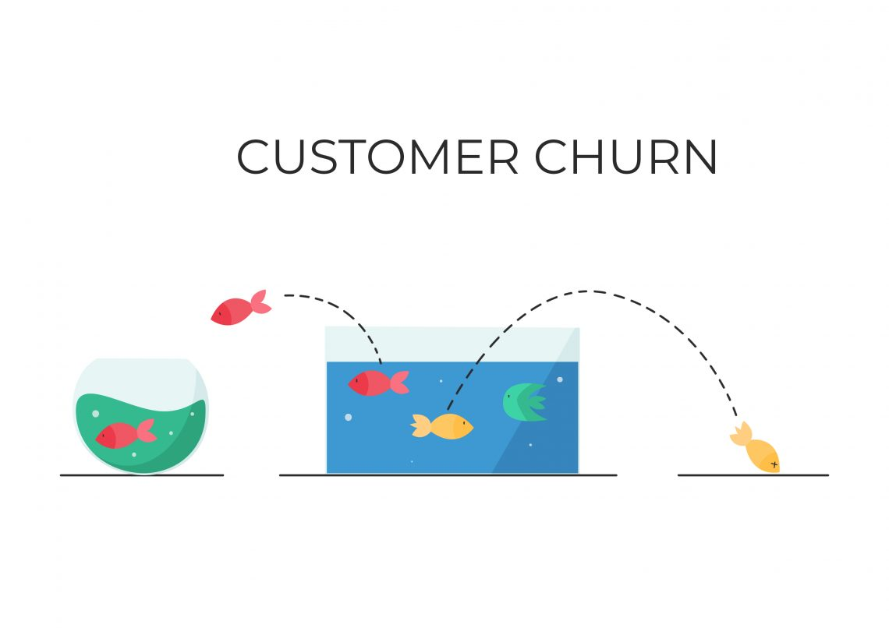
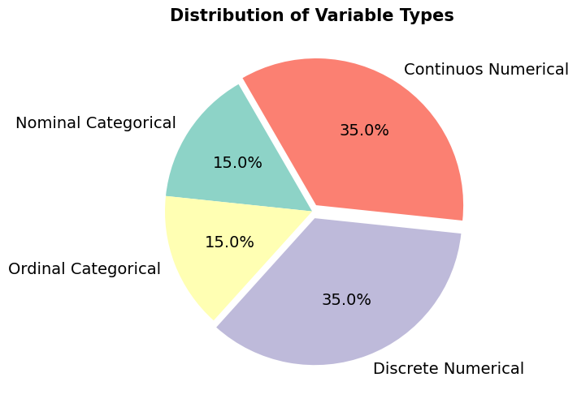
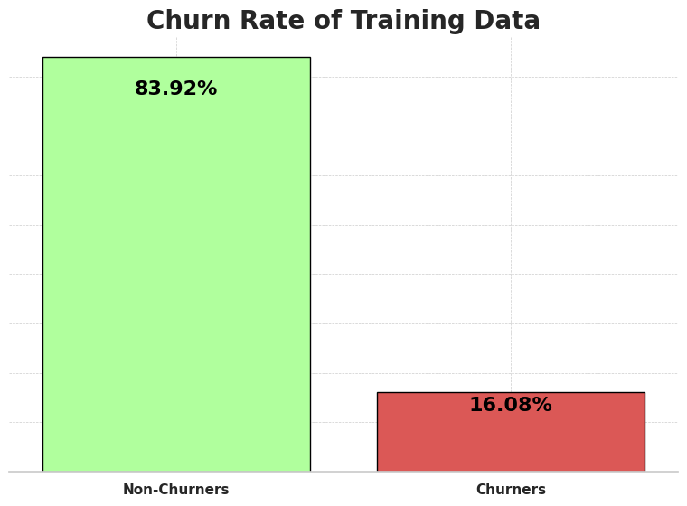
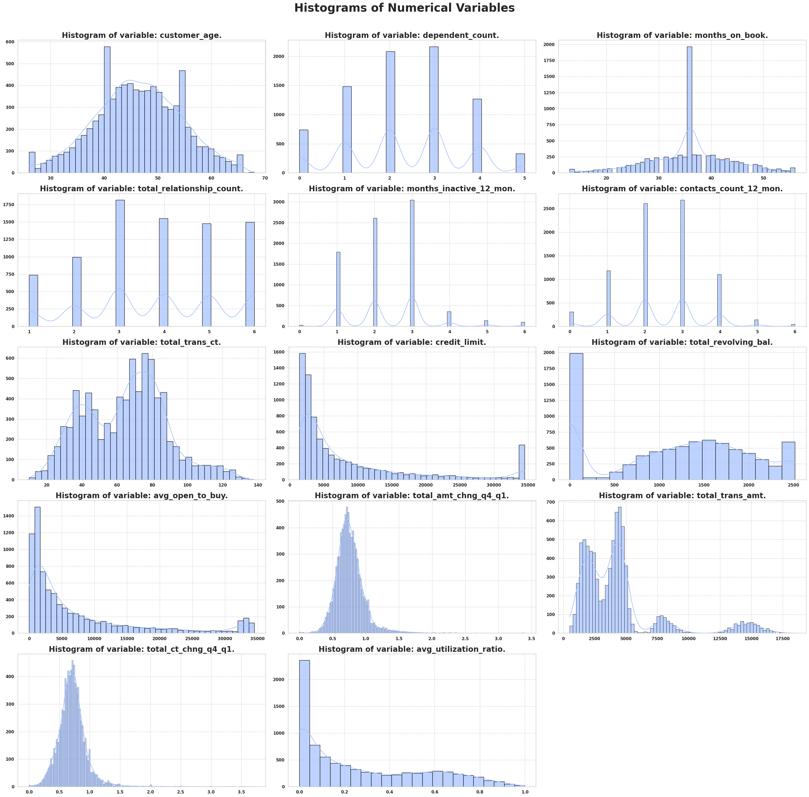
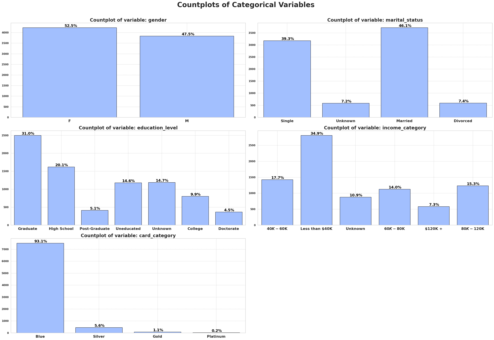

<a id="readme-top"></a>

<!-- PROJECT SHIELDS -->

[![Contributors][contributors-shield]][contributors-url]
[![Forks][forks-shield]][forks-url]
[![Stargazers][stars-shield]][stars-url]
[![Issues][issues-shield]][issues-url]
[![MIT License][license-shield]][license-url]
[![LinkedIn][linkedin-shield]][linkedin-url]

<!-- PROJECT LOGO -->

<br/>
<div align="center">
    
  
  <h3 align="center"> Churn Analysis/Prediction </h3>

  <p align="center">
    <h4>Customer churn classification of a credit card service with Pytorch as the main classification model.</h4>
    <br/>
    <a href="https://github.com/OtnielGomes/1_Portfolio-Credit-Card_Churn_Analysis_with_Pytorch/tree/main/src"><strong>Explore the Docs and Functions »</strong></a>
    <br/><br/>
    <a href="https://github.com/OtnielGomes/1_Portfolio-Credit-Card_Churn_Analysis_with_Pytorch/tree/main/notebooks">View Notebooks</a>
    ·
    <a href="https://github.com/OtnielGomes/1_Portfolio-Credit-Card_Churn_Analysis_with_Pytorch/issues/new?labels=bug&template=bug-report---.md">Report Bug</a>
    ·
    <a href="https://github.com/OtnielGomes/1_Portfolio-Credit-Card_Churn_Analysis_with_Pytorch/issues/new?labels=enhancement&template=feature-request---.md">Request Feature</a>
  </p>
</div>


<!-- TABLE OF CONTENTS -->
<details>
  <br>
  <summary>Table of Contents</summary>
  <br/>
  <ol>
    <li>
      <a href="#about-the-project">About The Project</a>
      <ul>
        <li><a href="#built-with">Built With</a></li>
      </ul>
    </li>
    <li>
      <a href="#getting-started">Getting Started</a>
      <ul>
        <li><a href="#pre-requisites">Pre-requisites</a></li>
        <li><a href="#installation-of-librarys">Installation of librarys</a></li>
      </ul>
    </li>
    <li>
      <a href="#the-project">The Project</a></li>
      <ul>
        <li><a href="#1-business-understanding">1-Business understanding</a></li>
        <li><a href="#2-data-understanding">2-Data Understanding</a></li>
        <li><a href="#3-data-preparation">3-Data Preparation</a></li>
        <li><a href="#4-modeling">4-Modeling</a></li>
        <li><a href="#5-evaluation">5-Evaluation</a></li>
        <li><a href="#6-deployment">6-Deployment</a></li>
      </ul>
    <li><a href="#roadmap">Roadmap</a></li>
    <li><a href="#contributing">Contributing</a></li>
    <li><a href="#license">License</a></li>
    <li><a href="#contact">Contact</a></li>
  </ol>
</details>

<br/>

<!-- ABOUT THE PROJECT -->
## About The Project

<br/>

## Credit Card Churn Analysis - Prediction
---  

## Project Description 
In this project, I will be working with a dataset provided by **Kaggle**, where I will develop a churn-rate analysis. The goal is to identify the causes and reasons for customer churn from a banking institution in relation to credit card services. After understanding these causes and reasons, some machine learning models will be developed to predict potential customers who will be abandoning the credit card service of this institution. With these predictions, I will seek to develop solutions to prevent or reverse the churn of these customers.  

---  

### CRISP-DM Methodology  
The project will follow the CRISP-DM (*Cross-Industry Standard Process for Data Mining*) framework:  

| **Stage** | **Objective** | **Key Actions** |  
|-----------|---------------|------------------|  
| **1. Business Understanding** | Define the impact of churn prediction on customer retention. | - Identify the causes and possible solutions for the business.<br>- Align metrics with business KPIs. |  
| **2. Data Understanding** | Analyze data structure, quality, and variable relationships. | - Exploratory Data Analysis (EDA).<br>- Outlier and correlation detection. |  
| **3. Data Preparation** | Prepare data for model training. | - Split training and test data.<br>- Remove redundant variables. |  
| **4. Modeling** | Train and compare classical models and neural networks. | - Random Forest/Logistic Regression (baseline).<br>- PyTorch neural network (focus on generalization). |  
| **5. Evaluation** | Validate performance with business-oriented metrics. | - AUC-ROC, Recall, confusion matrix.<br>- Simulate financial impact. |  
| **6. Deployment** | Deploy the model for production use. | - Build a final churn prediction model with customer behavior indicators. |  

<p align="right">(<a href="#readme-top">back to top</a>)</p>


<br/>

## Built With
<br/>

- [![Databricks][Databricks Free]][Databricks Free-url]
- [![Language Python][Python]][Python-url]
- [![Apache][Apache Spark]][Apache Spark-url]
- [![PD][Pandas]][Pandas-url]
- [![NP][NumPy]][NumPy-url]
- [![Matplot][Matplotlib]][Matplotlib-url]
- [![Scipy][Scipy]][Scipy-url]
- [![Torch][PyTorch]][PyTorch-url]
- [![Sklearn][scikit-learn]][scikit-learn-url]


<p align="right">(<a href="#readme-top">back to top</a>)</p>


<!-- GETTING STARTED -->
## Getting Started

<br/>

**Clone the repository**
```sh
git clone https://github.com/OtnielGomes/1_Portfolio-Credit-Card_Churn_Analysis_with_Pytorch
```
<br/>

### Pre-requisites

> 📌 **This entire project was built using Databricks Free Edition**.

---

### 🧠 What is Databricks Free Edition?

**Databricks Free Edition** is the free version of the Databricks platform, designed for **students, educators, developers, and data enthusiasts**.  
It replaces the former *Community Edition* and offers a **serverless** environment with limited resources — ideal for **prototyping, learning, and collaboration**.

With it, you can:
- Create interactive notebooks (Python, SQL, Scala, R)
- Use **Databricks Assistant** for code suggestions and corrections
- Train machine learning models and build data pipelines
- Collaborate in real time with other users

---

### 📝 How to Sign Up

#### 1. Go to:  
[Databricks Free Edition – Microsoft Learn](https://learn.microsoft.com/en-us/azure/databricks/getting-started/free-edition)  
#### 2. Sign in with Google, GitHub, Microsoft, or another supported provider.  
#### 3. A **free workspace** will be automatically created for you.

---

### 🧭 First Steps in the Workspace

### 1. **Workspace**
- Organize your notebooks, scripts, and datasets
- Create folders and set sharing permissions

### 2. **Notebook**
- Interactive interface for writing and running code
- Supports **Python, SQL, R, Scala**

### 3. **Databricks Assistant**
- AI-powered helper that explains, suggests, and fixes code
- Works in notebooks and SQL editor

---

### 🔧 What You Can Do in the Free Edition

| Feature                       | Description                                                                |
|--------------------------------|----------------------------------------------------------------------------|
| Create notebooks               | For data analysis, visualizations, and machine learning                   |
| Query data with SQL            | Explore datasets using the SQL editor                                     |
| Build data pipelines           | Using LakeFlow, Auto Loader, and Delta Live Tables                        |
| Train AI models                | With PySpark, MLflow, and foundation models                               |
| Create interactive dashboards  | With natural language-based visualization (Genie)                         |
| Collaborate in real time       | Share and edit notebooks with your team                                   |

---

### ⚠️ Limitations

- **Personal use only** (non-commercial)
- Limited computing resources (no dedicated clusters)
- Some advanced features unavailable (full Unity Catalog, scheduled jobs)

---

### 📚 Learning Resources

- [Databricks Academy](https://www.databricks.com/learn/free-edition) — free courses on:
  - SQL Fundamentals
  - Data Engineering with Delta Lake
  - Machine Learning with PySpark
- [Official Databricks Documentation](https://docs.databricks.com/)

### Installation of Libraries

The installation of the required libraries is performed using the command:

```python
%pip install '..\requirements.txt'
```

This command is present in the first notebook of this project.

---

💡 **Note**:  
- In Jupyter/Databricks notebooks, the `%pip` magic command installs packages directly into the current environment.  
- If your `requirements.txt` file is located in a subdirectory or at a different path, make sure to update the path accordingly (e.g., `../requirements.txt`).

<p align="right">(<a href="#readme-top">back to top</a>)</p>

<!-- USAGE EXAMPLES -->

<br/>

## The Project

### 1 - Business Understanding  
---

### General Problem Context  
#### What is Churn Rate, and What Are the Solutions to This Problem? 
Many companies struggle with customer churn and often find it challenging to reverse this trend. The metric that measures this scenario is called **churn rate**, which indicates when strategic solutions are needed to address the issue.  

In 2020, Bryce Baer published a guide on churn rate on the [Zendesk website](https://www.zendesk.com.br/blog/customer-churn-rate/?_ga=2.155312252.614584228.1623244699-1365810980.1622555740#) – a company specializing in corporate software development. The guide highlights that businesses implementing strategies to reduce churn can increase their **profitability** by nearly 40%.  

---

#### How to Calculate Churn Rate?
##### Churn Rate Formula:  
$$\text{Churn Rate} = \frac{\text{Number of customers lost during a period}}{\text{Total number of customers at the start of the period}} \times 100$$  

---

#### Impacts of a High Churn Rate
While reducing churn to zero is practically impossible, acceptable rates (4% to 5%) minimize financial impacts. Some companies operate at higher rates (5% to 7%) without significant revenue loss, depending on industry dynamics. **Key factors to define "acceptable" churn**:  
- Industry standards (e.g., SaaS vs. retail).  
- Customer lifetime value (CLV).  
- Customer acquisition cost (CAC).  

---

#### Reasons for Customer Churn
1. **Lack of Perceived Value**:  
   - Occurs when there’s a growing gap between customer expectations and actual delivery. Clear communication about product/service benefits is critical.  
2. **Poor Customer Experience**:  
   - Negative interactions (e.g., bad support, complex processes, product failures) drive churn.  
3. **Competitor Offers**:  
   - Attractive promotions or pricing from competitors can lure customers away.  
4. **Changing Customer Needs**:  
   - Failure to adapt products/services to evolving demands leads to turnover.  

---

## Project Challenge: 
The bank’s manager has observed a rising number of customers abandoning credit card services. Stakeholders aim to:  
1. **Analyze historical data** to identify root causes of churn.  
2. **Develop a machine learning model** to predict customer churn probability.  
3. **Implement strategic actions** to retain high-risk customers.  

---

## KPIs for the Churn Prediction Project:  
1. **Churn Rate**:  
   - *Definition*: Percentage of customers who discontinue credit card services within a specific period.  
   - *Goal*: Reduce this metric through targeted retention strategies.  

2. **Retention Rate**:  
   - *Definition*: Percentage of customers retained after a period.  
   - *Importance*: Directly reflects the success of retention efforts.  

3. **Customer Acquisition Cost (CAC) vs. Retention Cost**:  
   - *Definition*: Ratio of costs to acquire new customers vs. retaining existing ones.  
   - *Insight*: Retention is typically **5-7x cheaper** than acquisition.  

4. **AUC-ROC (Area Under the Receiver Operating Characteristic Curve)**:  
   - *Definition*: Measures the model’s ability to distinguish between churners and non-churners.  
   - *Target*: AUC-ROC > 0.90.  

5. **Recall**:  
   - *Definition*: Proportion of actual churners correctly identified by the model.  
   - *Importance*: High recall ensures fewer **false negatives** (missed churners), which is critical because a false negative could result in losing a customer. Retaining existing customers through targeted strategies is significantly cheaper than acquiring new ones.  

---

<p align="right">(<a href="#readme-top">back to top</a>)</p>

### 2 - Data Understanding

---

* This dataset consists of 10,000 customers mentioning their age, salary, marital_status, credit card limit, credit card category, etc.

---

- **Data file**: - BankChurners.csv

---

- **Target dependent variable**: - 'Attrition_Flag', categorical column with binary classification, i.e. 'Existing Customer'(No-churner) or 'Attrited Customer'(Churner).

---

- **The dataset colleted from kaggle**: https://www.kaggle.com/datasets/sakshigoyal7/credit-card-customers?sort=votes&select=BankChurners.csv

---
- **The dataset origin from this site**: https://leaps.analyttica.com/home

---

<br/>
<div align="left">
    
  </a>
</div>
<br/>


### 3 - Data Preparation
---

- In this step, I will initially divide the training and testing data so that the testing data does not interfere in the analyses, so that the model does not have any bias from the testing data, and only with the training data is it capable of generating good classifications with good generalization.
---
- Next, an EDA will be conducted to verify the data and its main characteristics. In this EDA, the main objective will be to understand the relationship of the data with the churn rate of this banking institution.
---
### Exploratory Data Analysis - EDA

The **Exploratory Data Analysis (EDA)** for this project will be carried out in three main stages: **Univariate Analysis**, **Bivariate Analysis**, and **Multivariate Analysis**.  
The goal is to explore and understand the patterns within the dataset, identifying relationships, trends, and potential insights that can guide the development of effective solutions.

---

#### Univariate Analysis  
- **What it is:** Examines **one variable at a time**, without considering its relationship to others.  
- **Purpose:** Understand the distribution, central tendency, and dispersion of the variable, as well as detect possible outliers.  

---

#### Bivariate Analysis  
- **What it is:** Studies **the relationship between two variables**.  
- **Purpose:** Identify correlations, patterns, or dependencies, and assess how one variable may influence the other.  

---

#### Multivariate Analysis  
- **What it is:** Investigates **three or more variables simultaneously**.  
- **Purpose:** Understand complex interactions and multidimensional patterns, identifying combinations of factors that influence the observed behavior.  

---

### Univariate Analysis 

<br/><br/>
<div align="left">
    
  </a>
</div>
<br/>

---

<br/><br/>
<div align="left">
    
  </a>
</div>
<br/>

---

<br/><br/>
<div align="left">
    
  </a>
</div>
<br/>

# 4-Modeling


<p align="right">(<a href="#readme-top">back to top</a>)</p>

# 5-Evaluation

### Considerations on initial training:


<p align="right">(<a href="#readme-top">back to top</a>)</p>

# 6-Deployment


<p align="right">(<a href="#readme-top">back to top</a>)</p>


<!-- ROADMAP -->
## Roadmap

- [Notebook-1-EDA](https://github.com/OtnielGomes/0_Portfolio-Credit_Risk_Analysis_with_Pytorch/blob/main/1_Notebooks/0_EDA.ipynb)
- [Notebook-2-Modeling](https://github.com/OtnielGomes/0_Portfolio-Credit_Risk_Analysis_with_Pytorch/blob/main/1_Notebooks/1_Modeling.ipynb)


See the [open issues](https://github.com/OtnielGomes/0_Portfolio-Credit_Risk_Analysis_with_Pytorch/issues) for a full list of proposed features (and known issues).

<p align="right">(<a href="#readme-top">back to top</a>)</p>


<!-- CONTRIBUTING -->
## Contributing

Contributions are what make the open source community such an amazing place to learn, inspire, and create. Any contributions you make are **greatly appreciated**.

If you have a suggestion that would make this better, please fork the repo and create a pull request. You can also simply open an issue with the tag "enhancement".
Don't forget to give the project a star! Thanks again!

1. Fork the Project
2. Create your Feature Branch (`git checkout -b feature/AmazingFeature`)
3. Commit your Changes (`git commit -m 'Add some AmazingFeature'`)
4. Push to the Branch (`git push origin feature/AmazingFeature`)
5. Open a Pull Request

<p align="right">(<a href="#readme-top">back to top</a>)</p>

### Top contributors:

<a href="https://github.com/OtnielGomes/0_Portfolio-Credit_Risk_Analysis_with_Pytorch/graphs/contributors">
  
</a>


<!-- LICENSE -->
## License

Distributed under the MIT License. See [`LICENSE.txt`](https://github.com/OtnielGomes/0_Portfolio-Credit_Risk_Analysis_with_Pytorch/blob/main/LICENSE) for more information.

<p align="right">(<a href="#readme-top">back to top</a>)</p>


<!-- CONTACT -->
## Contact

Otniel Gomes - [linkedin.com/in/otnielgomes](https://www.linkedin.com/in/otnielgomes/) - otniel.g.andrade@gmail.com

Project Link: [https://github.com/OtnielGomes/0_Portfolio-Credit_Risk_Analysis_with_Pytorch](https://github.com/OtnielGomes/0_Portfolio-Credit_Risk_Analysis_with_Pytorch)

<p align="right">(<a href="#readme-top">back to top</a>)</p>


<!-- MARKDOWN LINKS & IMAGES -->
<!-- https://www.markdownguide.org/basic-syntax/#reference-style-links -->

[contributors-shield]: https://img.shields.io/github/contributors/OtnielGomes/0_Portfolio-Credit_Risk_Analysis_with_Pytorch.svg?style=for-the-badge
[contributors-url]: https://github.com/OtnielGomes/0_Portfolio-Credit_Risk_Analysis_with_Pytorch/graphs/contributors

[forks-shield]: https://img.shields.io/github/forks/OtnielGomes/0_Portfolio-Credit_Risk_Analysis_with_Pytorch.svg?style=for-the-badge
[forks-url]: https://github.com/OtnielGomes/0_Portfolio-Credit_Risk_Analysis_with_Pytorch/network/members

[stars-shield]: https://img.shields.io/github/stars/OtnielGomes/0_Portfolio-Credit_Risk_Analysis_with_Pytorch.svg?style=for-the-badge
[stars-url]: https://github.com/OtnielGomes/0_Portfolio-Credit_Risk_Analysis_with_Pytorch/stargazers

[issues-shield]: https://img.shields.io/github/issues/OtnielGomes/0_Portfolio-Credit_Risk_Analysis_with_Pytorch.svg?style=for-the-badge
[issues-url]: https://github.com/OtnielGomes/0_Portfolio-Credit_Risk_Analysis_with_Pytorch/issues

[license-shield]: https://img.shields.io/github/license/OtnielGomes/0_Portfolio-Credit_Risk_Analysis_with_Pytorch.svg?style=for-the-badge
[license-url]: https://github.com/OtnielGomes/0_Portfolio-Credit_Risk_Analysis_with_Pytorch/blob/master/LICENSE.txt

[linkedin-shield]: https://img.shields.io/badge/-LinkedIn-black.svg?style=for-the-badge&logo=linkedin&colorB=555
[linkedin-url]: https://linkedin.com/in/otnielgomes

[Azure Databricks]: https://img.shields.io/badge/Databricks-FF3621?style=for-the-badge&logo=Databricks&logoColor=white
[Azure Databricks-url]:  https://azure.microsoft.com/en-us/pricing/purchase-options/azure-account?icid=databricks

[PyTorch]: https://img.shields.io/badge/PyTorch-%23EE4C2C.svg?style=for-the-badge&logo=PyTorch&logoColor=white
[PyTorch-url]: https://pytorch.org

[scikit-learn]: https://img.shields.io/badge/scikit--learn-%23F7931E.svg?style=for-the-badge&logo=scikit-learn&logoColor=white
[scikit-learn-url]: https://scikit-learn.org/stable/

[Apache Spark]: https://img.shields.io/badge/Apache%20Spark-FDEE21?style=flat-square&logo=apachespark&logoColor=black
[Apache Spark-url]: https://spark.apache.org/

[Pandas]: https://img.shields.io/badge/pandas-%23150458.svg?style=for-the-badge&logo=pandas&logoColor=white
[Pandas-url]: https://pandas.pydata.org/

[Matplotlib]: https://img.shields.io/badge/Matplotlib-%23ffffff.svg?style=for-the-badge&logo=Matplotlib&logoColor=black
[Matplotlib-url]: https://matplotlib.org/

[Scipy]: https://img.shields.io/badge/SciPy-%230C55A5.svg?style=for-the-badge&logo=scipy&logoColor=%white
[Scipy-url]: https://scipy.org/

[NumPy]: https://img.shields.io/badge/numpy-%23013243.svg?style=for-the-badge&logo=numpy&logoColor=white
[NumPy-url]: https://numpy.org/

[Python]: https://img.shields.io/badge/python-3670A0?style=for-the-badge&logo=python&logoColor=ffdd54
[Python-url]: https://www.python.org/

[Databricks Free]: https://img.shields.io/badge/Databricks-FF3621?style=for-the-badge&logo=Databricks&logoColor=white
[Databricks Free-url]: https://www.databricks.com/br/learn/free-edition
